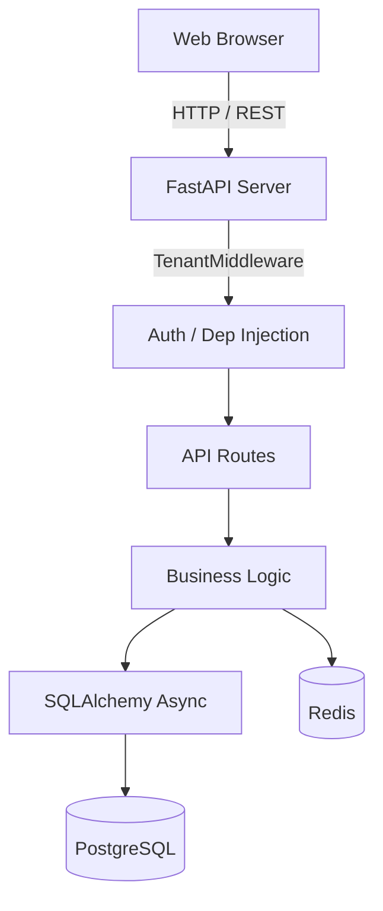

# Project Context: Architecture

## 1. Purpose
This document establishes the architecture of InsureIQ as actually implemented in the repository. It is intended to help future implementation agents understand the structural boundaries and flow of the system.

## 2. Current Understanding

InsureIQ is a multi-tenant B2B2C Insurance Platform.

### 2.1 Technology Stack
- **Frontend**: React 18, TypeScript, Vite, Tailwind CSS, Zustand (State), Axios (API Client), React Router v6.
- **Backend**: FastAPI (Python 3.11), SQLAlchemy 2.0 (Async), Pydantic v2.
- **Database**: PostgreSQL 16 (with pgvector), Asyncpg driver.
- **Cache / Background**: Redis 7.
- **Authentication**: JWT (JSON Web Tokens) with bcrypt password hashing.

### 2.2 System Architecture Flow

### 2.3 Key Architectural Patterns

#### Tenant Isolation
The system employs logical tenant isolation. Almost every table in the database contains a `tenant_id` column.
1. The frontend injects an `X-Tenant-ID` header (or it is resolved via subdomains/headers).
2. `TenantMiddleware` extracts this and stores it in context.
3. Every API call filters queries by `tenant_id`. Cross-tenant data access is strictly forbidden by design.
4. `superadmin` users interact with the `console` routes, which may bypass tenant isolation to manage tenants themselves.

#### Security & Roles
- Global `get_current_user` dependency resolves the JWT token.
- Role guards (`require_role(["role1", "role2"])`) are applied directly to route definitions.
- Passwords and tokens are stored in the `passwords` and `refresh_tokens` tables.

#### Frontend Application Shells
The React frontend uses shell components to wrap protected routes based on roles:
- `SuperAdminShell`: Wraps `/admin/*` routes for `superadmin` users. **⚠️ KNOWN BUG**: `AuthSuperAdminShell` renders a stub component (`<AdminHome />`) instead of `<Outlet />`, so child routes under `/admin` cannot render.
- `B2BShell`: Wraps **`/b2b/*`** routes for `agent`, `underwriter`, `adjuster`, and `admin` roles. **NOTE**: Console pages (`/b2b/console*`) are embedded here, meaning they are navigable by all B2B users (frontend only; backend API rejects non-superadmin calls).
- `MarketplaceShell`: Wraps public B2C pages (`/marketplace/*`) and authenticated customer pages (`/portal/*`).

## 3. Evidence / Source Locations
- `backend/app/main.py`: Entry point and CORS/Middleware config.
- `backend/app/api/middleware.py`: `TenantMiddleware`.
- `backend/app/api/deps.py`: `get_current_user`, `require_role`.
- `frontend/src/router.tsx`: React router configuration and layout shells.
- `docker-compose.yml`: Services (Postgres, Redis, API, UI).

## 4. Implementation Implications
- When building new features, the `tenant_id` must ALWAYS be populated for business entities.
- Ensure new backend routes use `require_role(...)` to explicitly declare who can access them.
- All database operations should be asynchronous (`await session.execute(...)`).

## 5. Known Uncertainties
- Exactly how the `X-Tenant-ID` header is derived by the frontend in production if users hit a custom domain is not fully detailed in code (it seems derived from the JWT payload by `TenantMiddleware`).

## 6. Known Tenant Isolation Gaps (MVP)
> [!WARNING]
> Tenant isolation is **NOT fully enforced** in the MVP. The following endpoints are missing `tenant_id` filters and will return cross-tenant data:
> - `GET /api/v1/agent/customers` — returns all `Customer` records, not filtered by tenant.
> - `GET /api/v1/claims/queue` — returns all active claims, not filtered by tenant.
> - `GET /api/v1/underwriting/queue` — returns all pending applications, not filtered by tenant.
> These are known limitations and must be addressed before production deployment.

## 6. Dependencies
Depends on Postgres and Redis running via Docker.
